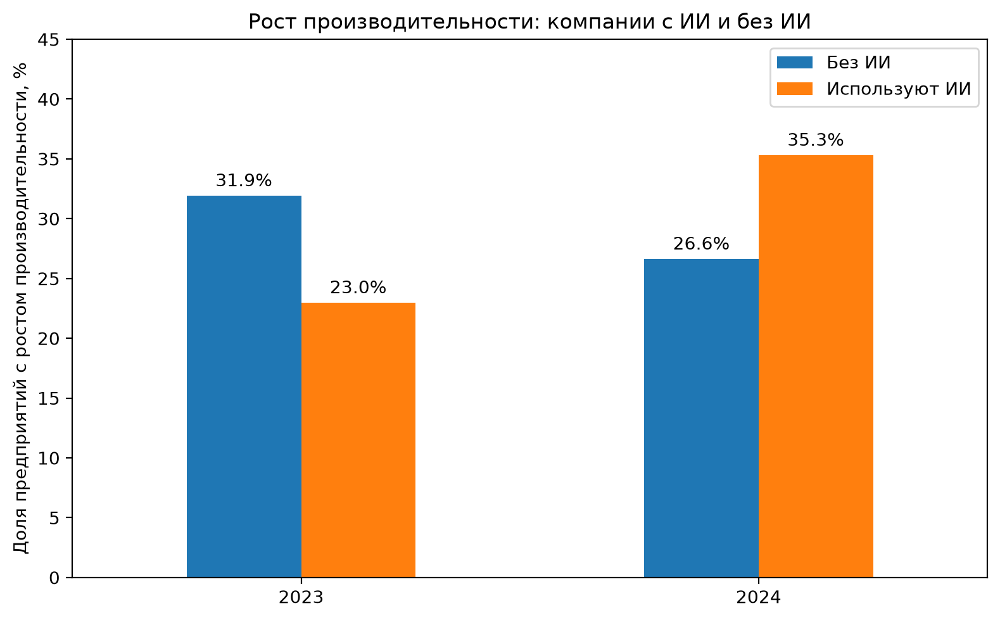
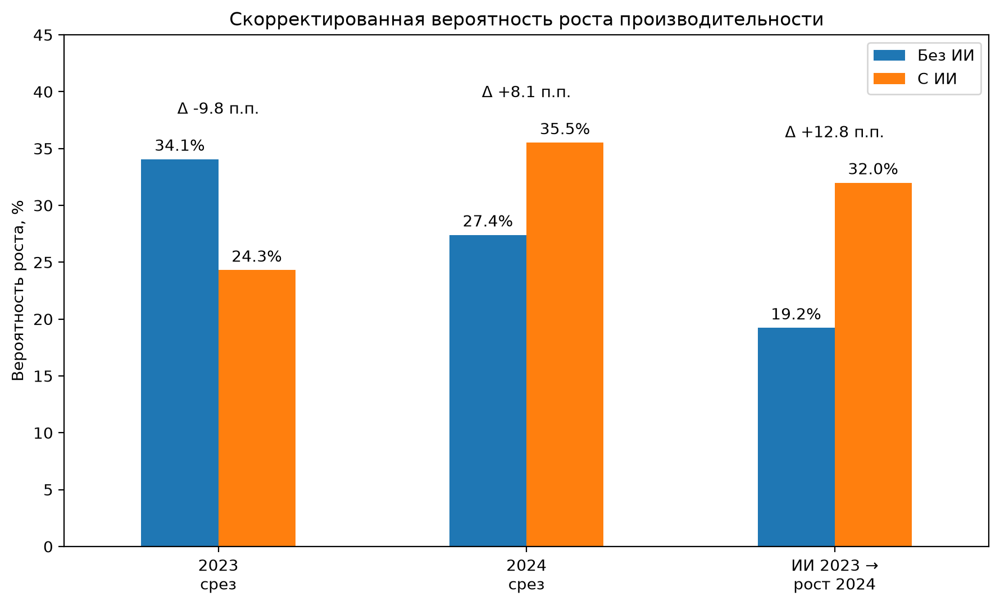
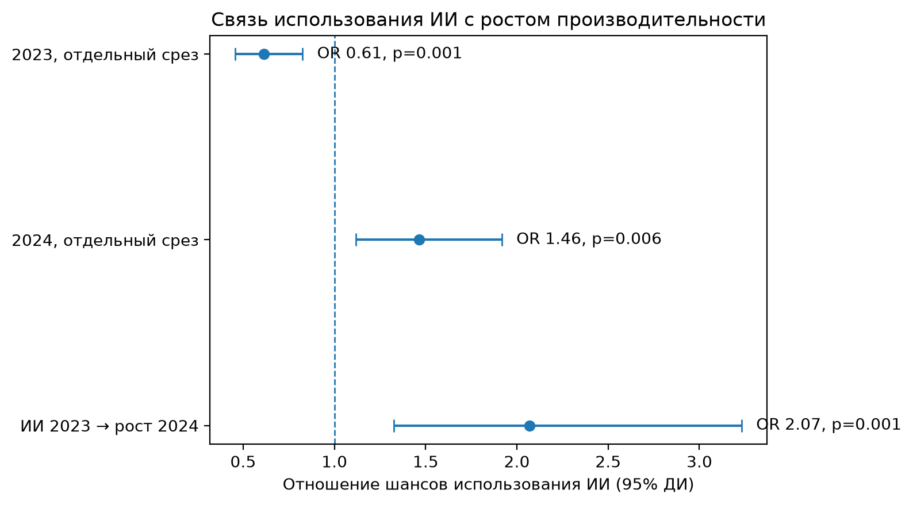

# ИИ и производительность компаний

### Эмпирический анализ российских предприятий за 2023–2024 годы

Исследовательский проект о связи между использованием технологий искусственного интеллекта и динамикой производительности российских предприятий.

Анализ основан на двух волнах опросов предприятий за 2023 и 2024 годы и включает как сравнение отдельных волн, так и панельный анализ одних и тех же компаний во времени.

## Исследовательский вопрос

Связано ли использование искусственного интеллекта с более высокой вероятностью роста производительности предприятия и сохраняется ли эта связь при наблюдении одних и тех же компаний во времени?

## Данные

Используются две волны опросов российских предприятий:

- **2023:** 1 200 предприятий
- **2024:** 1 212 предприятий
- **545 предприятий** удалось однозначно сопоставить между двумя волнами

Исходные микроданные не публикуются из-за ограничений конфиденциальности. Подробнее: [`data/README.md`](data/README.md).

## Методы

В проекте используются:

- взвешенная описательная статистика;
- логистическая регрессия;
- панельное сопоставление предприятий между двумя волнами;
- скорректированные модельные вероятности;
- Ordered Logit как проверка устойчивости результата.

В моделях учитываются размер предприятия, отрасль и, в основной панельной спецификации, предыдущая динамика производительности.

## Основные результаты

### 1. Различия между 2023 и 2024 годами

В 2023 году предприятия с ИИ реже сообщали о росте производительности:

- без ИИ — **31,91%**
- с ИИ — **22,96%**

В 2024 году направление связи изменилось:

- без ИИ — **26,62%**
- с ИИ — **35,30%**

После учёта размера предприятия и отрасли скорректированная разница составила:

- **2023: −9,76 п.п.**
- **2024: +8,11 п.п.**



### 2. Панельный анализ

В основной панельной модели использовались **486 предприятий**, наблюдаемых в обеих волнах и имеющих необходимые данные.

После учёта:

- размера предприятия;
- отрасли;
- предыдущей динамики производительности

использование ИИ в 2023 году было связано с **+12,76 п.п. более высокой скорректированной вероятностью роста производительности в 2024 году** (`p ≈ 0,001`).



### 3. Проверка устойчивости

Основной результат был дополнительно проверен на исходной пятиуровневой шкале изменения производительности с помощью Ordered Logit.

Коэффициент при использовании ИИ остался положительным и статистически значимым:

**β ≈ 0,50, p ≈ 0,013**



## Интерпретация

Результаты показывают устойчивую положительную связь между использованием ИИ в 2023 году и последующей динамикой производительности предприятий в 2024 году.

При этом результаты **не следует интерпретировать как причинный эффект**. Данные являются наблюдательными, поэтому невозможно полностью исключить влияние ненаблюдаемых различий между компаниями.

## Структура проекта

```text
ai-firm-productivity/
├── README.md
├── data/
│   └── README.md
├── notebooks/
│   └── 02_final_analysis.ipynb
└── outputs/
    └── figures/
        ├── 01_productivity_growth_ai_vs_no_ai.png
        ├── 02_adjusted_productivity_growth.png
        └── 03_ai_effect_forest_plot.png
```

## Технологии

**Python · pandas · NumPy · statsmodels · Matplotlib · Jupyter Notebook**

## Анализ

Полный код анализа находится в:

[`notebooks/02_final_analysis.ipynb`](notebooks/02_final_analysis.ipynb)